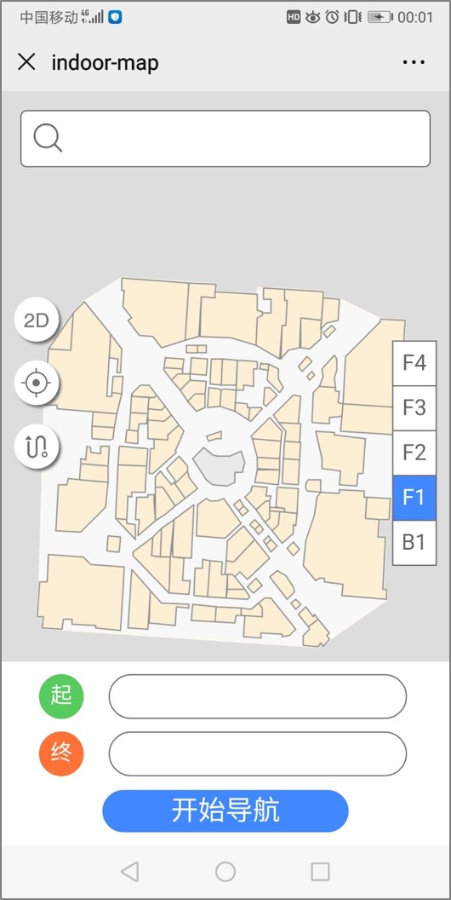

### 项目介绍

本项目是一个移动端室内导航地图系统，目前只是基于Vue + leaflet 搭建了前端界面，实现了地图展示和楼层的切换，后期打算基于Node和MongoDB开发后端部分，实现POI查询和路径规划等功能。如果可以的话将进一步封装成HybridAPP，能够实现实时定位功能。

### 项目演示

项目使用Nginx部署在百度云服务器上

pc端：[请戳这里]( http://106.13.23.235:3001/ )（建议使用chrome手机模式预览）

移动端：

<div></div>

### 技术栈

vue + vuex + leaflet + webpack + ES6 + axios

### 项目运行

项目使用vue-cli4

```shell
npm run serve    #运行项目
npm run build    #打包项目
```

### 系统展示

总共封装了5个组件，搜索框，工具栏，楼层切换，导航工具栏和地图组件。

<div>
    
</div>

### 地图数据

地图数据是GeoJson文件形式，每一层的数据单独保存在一个文件中，通过axios读取文件数据，通过leaflet进行地图的可视化。